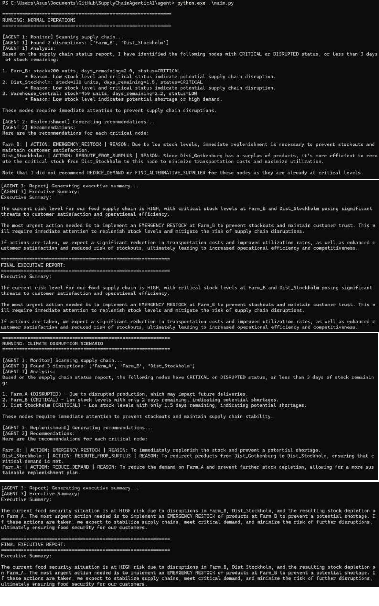
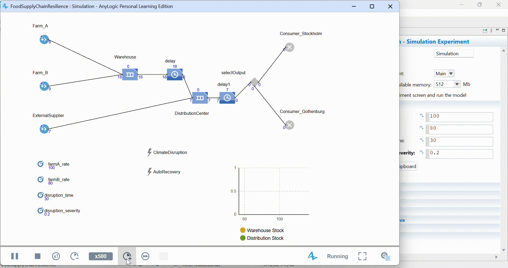
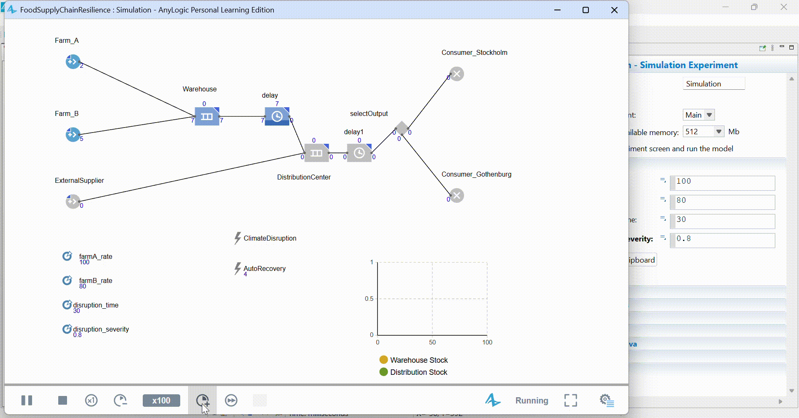
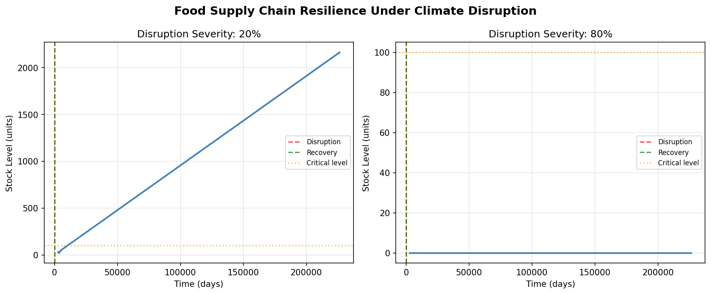
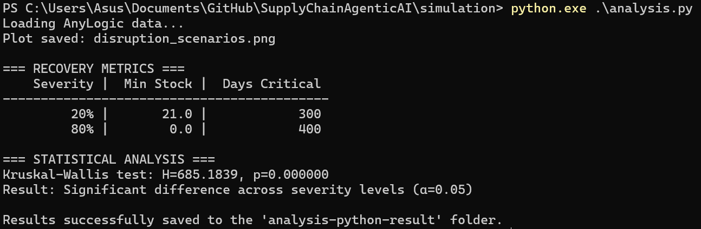
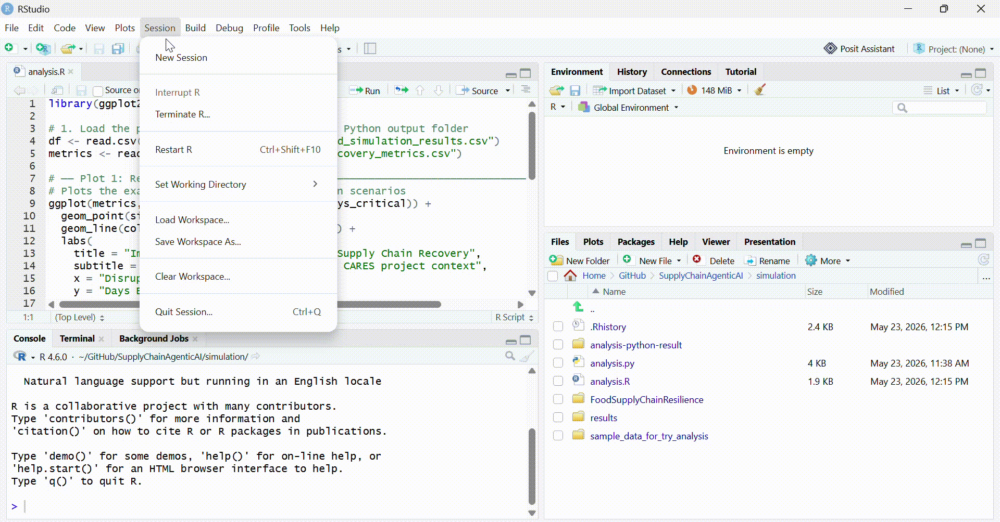

# "SupplyChainAgenticAI" - Food Supply Chain Resilience Agent (LangChain + LangGraph)

A multi-agent system that monitors a food supply chain, detects disruptions, and autonomously decides on replenishment actions. 
It monitors food supply chain nodes, detects  disruptions (climate shocks, stock failures), and autonomously  generates replenishment recommendations.

Free tools: LangChain + Ollama (runs LLM locally, completely free, no API key needed)


## Research Context

Built to explore agentic AI approaches to supply chain resilience — relevant to EU food security research (e.g. CARES project framework).


## Food Supply Chain Resilience: Agentic AI & Simulation

This repository contains a proof-of-concept exploring how food supply chains can autonomously adapt to severe climate and geopolitical disruptions. The project combines traditional discrete-event simulation with modern, privacy-preserving agentic AI to monitor, model, and manage supply chain shocks.

It is built specifically to explore autonomous adaptation frameworks relevant to food security research and complex systems engineering.


## Technologies

- LangGraph (multi-agent orchestration)
- LangChain + Ollama (local LLM, no cost)
- Python, Pandas


## Project Architecture

How the data flow? ```Monitor Agent → Replenishment Agent → Report Agent```

- **Monitor Agent**: Scans all supply chain nodes, flags critical stock levels
- **Replenishment Agent**: Recommends actions (reroute, emergency restock, etc.)
- **Report Agent**: Synthesises executive summary for decision-makers

The repository is divided into two distinct modeling approaches:

### 1. Autonomous Agentic AI (`/agent`)
A multi-agent system designed to monitor logistics data, detect critical disruptions, and propose immediate replenishment strategies. 
* **Local & Private:** Runs entirely locally using Ollama. This ensures sensitive enterprise supply chain data never leaves the local machine.
* **LangGraph Orchestration:** Utilizes a three-node agent graph:
  * **Monitor Agent:** Scans inventory data to identify nodes critically low on days-of-stock.
  * **Replenishment Agent:** Evaluates disruptions and prescribes specific actions (e.g., rerouting, emergency restocks, activating backup suppliers).
  * **Report Agent:** Synthesizes the data into a rapid executive summary for decision-makers.

### 2. Complex Systems Simulation & Analysis (`/simulation`)
A physical simulation of a 3-node food supply network (Farms → Warehouse → Distribution Center → Consumers) facing a severe climate shock.
* **AnyLogic Physics:** Models the physical reality of inventory flow, queue bottlenecks, and transit delays. We simulate normal operations, introduce a production crash at time=30, and trigger automated backup recovery at time=45.
* **Python Aggregation:** Reads the exported simulation data, aligns the time-series variables, and plots the inventory curves to visualize the impact of different disruption severities.
* **R Statistical Modeling:** Applies Kruskal-Wallis tests and linear models to the simulation output to statistically quantify the relationship between disruption severity and recovery time.


## Repository Structure

```text
supply-chain-resilience/
│
├── README.md
├── requirements.txt
│
├── agent/                         
│   ├── supply_data.py             # Generates mock supply chain logistics data
│   ├── agents.py                  # LangGraph multi-agent logic
│   └── main.py                    # Entry point to run the LLM scenario
│
├── simulation/                    
│   ├── FoodSupplyChainResilience
│   │    └── FoodSupplyChain.alp        # AnyLogic model source file
│   ├── results/                   # Raw CSV exports from AnyLogic
│   │    ├── Normal_Disruption.csv        # AnyLogic output that become the CSV input for analysis (analysis.R and analysis.py)
│   │    └── ExtremeDisruption.csv        # AnyLogic output that become the CSV input for analysis (analysis.R and analysis.py)
│   ├── analysis.py                # Python data aggregation and visualization
│   ├── analysis.R                 # R statistical analysis script
│   └── analysis-python-result/    # Output charts and processed metrics exported from analysis.py
│
└── Documentation/
    ├── 1 agent-running-main.py/               # Visuals output from the agent/main.py
    ├── 2 AnyLogic/                            # Visuals when running AnyLogic UI
    └── 3 analysis-python-result/              # Visuals and exported result of running analysis.py
```


## Scenarios

- Normal operations: baseline monitoring
- Climate disruption: Farm_A supply cut 60%, system adapts


## Quick Start Guide

### Prerequisites

- Python 3.10+
- R and RStudio
- AnyLogic Personal Learning Edition (to view or modify the .alp file)
- Ollama installed locally


## Setup (fully free, no API key needed)

### Running the AI Agent
```bash
# 1. Install Ollama: https://ollama.com
ollama pull llama3.2

# 2. Install dependencies
pip install -r requirements.txt

# 3. Run the scenario
cd agent
python main.py
```



### Running the Statistical Analysis
The raw AnyLogic CSV data is already provided in the simulation/results/ folder.

Normal Distruption:


Extreme Distruption:



### Running the Statistical Analysis

```bash
# 1. Generate the plots and recovery metrics using Python:
cd simulation
python analysis.py
```




```bash
# 2. Run the statistical tests in R:
Open analysis.R in RStudio, set your working directory to the simulation folder, and execute the script to view the linear model output.
```




## Result & Documentation

The running result had been saved to: `\Documentation`

[📄 Read the Full Academic Simulation Report (PDF)](Documentation/Supply_Chain_Resilience_Report.pdf)


